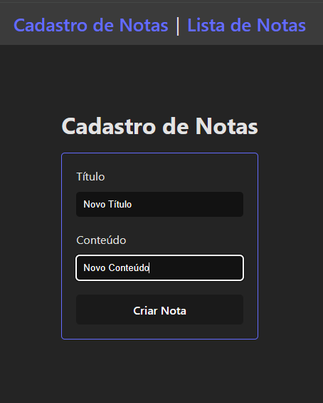
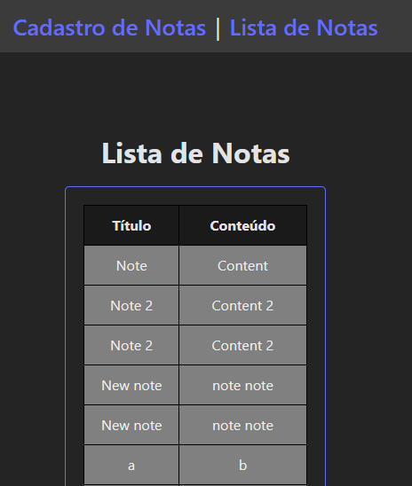

# Gerenciador de Notas - Frontend

[Tecnologias](#tecnologias) | [Funcionalidades](#funcionalidades) | [Descrição](#descrição) | [Instalação](#instalação) | [Avisos](#avisos) | [Imagens](#imagens) | [Suporte](#suporte) | [Todo](#todo) | [Lista de bugs](#lista-de-bugs) | [Bugs Resolvidos](#bugs-resolvidos)

## Tecnologias

<ul>
  <li>Vue</li>
  <li>Axios</li>
  <li>Pinia</li>
  <li>Oh, Vue Icons!</li>
  <li>Vue Router</li>
</ul>

[Ir para o topo](#gerenciador-de-notas---frontend)

## Funcionalidades


[Ir para o topo](#gerenciador-de-notas---frontend)

## Descrição


[Ir para o topo](#gerenciador-de-notas---frontend)

## Instalação

1. Faça um clone do repositório:
```bash
git clone git@github.com:rushxpush/gerenciador-notas-frontend.git
cd gerenciador-notas-frontend 
```

2. Monte a imagem e rode:
```bash
docker compose up --build
```

3. Não esqueça de montar a imagem do backend e rodar. Link: [gerenciador-notas-backend](https://github.com/rushxpush/gerenciador-notas-backend)

4. Acesse a página em [localhost:8085](http://localhost:8085)

[Ir para o topo](#gerenciador-de-notas---frontend)

## Avisos

Futuros avisos

[Ir para o topo](#gerenciador-de-notas---frontend)

## Imagens






## Suporte

Qualquer dúvida mande um email para [rafagarciadev@gmail.com](mailto:rafagarciadev@gmail.com)

[Ir para o topo](#gerenciador-de-notas---frontend)

## Todo 

- &check; Componente ui Input.vue
- &check; Componente ui Navbar.vue
- &check; View de Criação de Notas (HomeView.vue)
- &check; View de Visualização de Notas criadas (NotesListView.vue)
- &check; Componente de Criação de Notas (CreateNoteForm.vue)
- &check; Componente de Visualização de Notas (NotesList.vue)
- &check; Setup do router (router.ts)
- &check; API para interação com rota /notes (notesAPI.ts)
- &check; Composable para encapsulamento das funções de notesAPI (useNotes.ts)
- &#x2610; Teste unitário CreateNoteForm.vue
- &#x2610; Teste unitário NotesListView.vue
- &#x2610; Teste unitário Input.vue
- &#x2610; Teste unitário api/notesAPI.ts
- &#x2610; Teste unitário  composables/useNotes.ts
<!-- - &check;  -->
<!-- - &#x2610;  -->

## Lista de bugs

- &#x2610; Acessar qualquer link que não seja http://localhost:8085 na barra de navegação gera um erro de página não encontrada (falta configurar o servidor para dar suporte ao Vue Router)

[Ir para o topo](#gerenciador-de-notas---frontend)

## Bugs Resolvidos

[Ir para o topo](#gerenciador-de-notas---frontend)